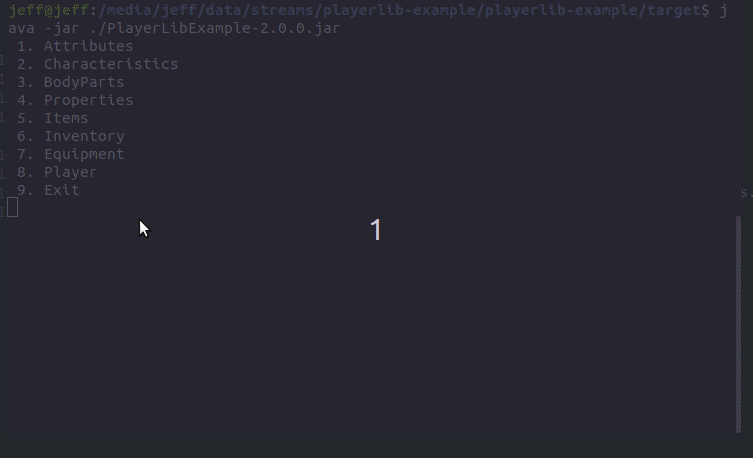

# playerlib-example
This project provides a console based implementation of playerlib (https://github.com/JeffreyRiggle/playerlib).

## Getting Started
### Prerequisites
Java 8 SDK should be installed on your local machine.
Maven should be installed on your local machine.

## Building
Navigate to `./playerlib-example` and run `mvn install`

## Running
After building navigate to `/playerlib-example/target` and run `java -jar PlayerLibExample-1.0.0-SNAPSHOT.jar`

## License
This project is licensed under the MIT License - see the LICENSE.md file for details.
